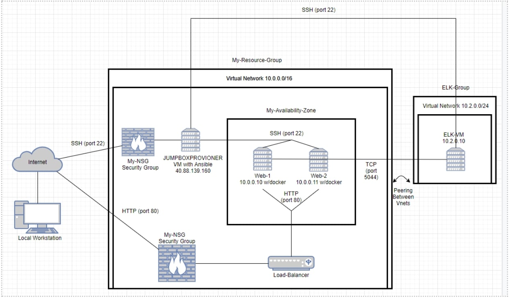
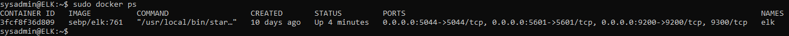

## Automated ELK Stack Deployment

The files in this repository were used to configure the network depicted below.

These files have been tested and used to generate a live ELK deployment on Azure. They can be used to either recreate the entire deployment pictured above. Alternatively, select portions of the _____ file may be used to install only certain pieces of it, such as Filebeat.

  - _TODO: Enter the playbook file._

This document contains the following details:
- Description of the Topologu
- Access Policies
- ELK Configuration
  - Beats in Use
  - Machines Being Monitored
- How to Use the Ansible Build

### Description of the Topology

The main purpose of this network is to expose a load-balanced and monitored instance of DVWA, the D*mn Vulnerable Web Application.

Load balancing ensures that the application will be highly available, in addition to restricting traffic to the network.
- Load balances distribute network traffic across multiple machines. If one machine goes down, the other machines will take on the extra load and the server will remain functioning. This makes networks redundant and highly accessible.
Integrating an ELK server allows users to easily monitor the vulnerable VMs for changes to the _____ and system _____.
- _TODO: What does Filebeat watch for?_
- _TODO: What does Metricbeat record?_

The configuration details of each machine may be found below.
_Note: Use the [Markdown Table Generator](http://www.tablesgenerator.com/markdown_tables) to add/remove values from the table_.

| Name     | Function | IP Address | Operating System |
|----------|----------|------------|------------------|
| JUMPBOXPROVISIONER | Gateway  | 10.0.0.9/40.88.139.160   | Linux            |
| Web-1     | DVWA Server         | 10.0.0.10           |    Linux              |
| Web-2     |  DVWA Server        |  10.0.0.11          |          Linux        |
| Elk Server     |  ElasticSearch Stack        | 10.2.0.4/20.98.64.48           |  Linux                |

### Access Policies

The machines on the internal network are not exposed to the public Internet. 

Only the jumpbox machine can accept connections from the Internet. Access to this machine is only allowed from the following IP addresses:
- My home's previous public IP: 115.64.18.217

Machines within the network can only be accessed by the jumpbox machine.
- The ELK (monitoring) VM can only be accessed from the jumpbox machine with private ip 10.0.0.9 through port 5601
A summary of the access policies in place can be found in the table below.

| Name     | Publicly Accessible | Allowed IP Addresses |
|----------|---------------------|----------------------|
| Jump Box | No              | 115.64.18.217 - ssh (port 22)    |
| Web machines         |  No   |  10.0.0.9 - ssh (port 22)         |
| ELK     | No     |  10.0.0.9 - (port 5601, port 9200)            |
### Elk Configuration

Ansible was used to automate configuration of the ELK machine. No configuration was performed manually, which is advantageous because ansible can configure multiple machines at a single time. This removes the risk of disparities in configurations between machines, and is much quicker.

The playbook implements the following tasks:
- Installs Docker
- Installs python3-pip
- Increase memory usage to 262144
- Download and launch a docker ELK container
- Enable ELK service on launch

The following screenshot displays the result of running `docker ps` after successfully configuring the ELK instance.

### Target Machines & Beats
This ELK server is configured to monitor the following machines:
- 10.0.0.10 - Web-1
- 10.0.0.11 - Web-2

We have installed the following Beats on these machines:
- _TODO: Specify which Beats you successfully installed_

These Beats allow us to collect the following information from each machine:
- _TODO: In 1-2 sentences, explain what kind of data each beat collects, and provide 1 example of what you expect to see. E.g., `Winlogbeat` collects Windows logs, which we use to track user logon events, etc._

### Using the Playbook
In order to use the playbook, you will need to have an Ansible control node already configured. Assuming you have such a control node provisioned: 

SSH into the control node and follow the steps below:
- Copy the _____ file to _____.
- Update the _____ file to include...
- Run the playbook, and navigate to ____ to check that the installation worked as expected.

_TODO: Answer the following questions to fill in the blanks:_
- _Which file is the playbook? Where do you copy it?_
- _Which file do you update to make Ansible run the playbook on a specific machine? How do I specify which machine to install the ELK server on versus which to install Filebeat on?_
- _Which URL do you navigate to in order to check that the ELK server is running?

_As a **Bonus**, provide the specific commands the user will need to run to download the playbook, update the files, etc._
